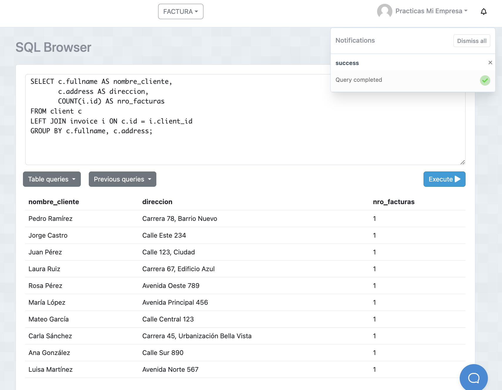
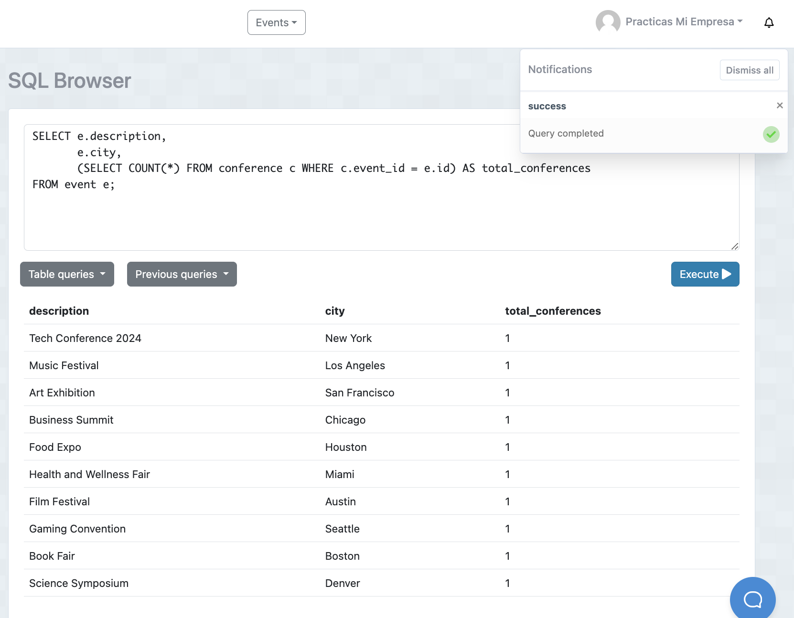

# Tarea B.D.Events

## 1. Número total de facturas realizadas por cada cliente
  - Sentencia:
  ```
  SELECT c.fullname AS nombre_cliente, 
       c.address AS direccion, 
       COUNT(i.id) AS nro_facturas
FROM client c
LEFT JOIN invoice i ON c.id = i.client_id
GROUP BY c.fullname, c.address;

  ```
  - Captura:



## 2.  Nombre y correo de los clientes junto a su compra más cara realizada:
  - Sentencia:
  ```
  SELECT c.fullname AS nombres, 
       c.email, 
       (SELECT MAX(d.price * d.quantity) 
        FROM invoice i 
        JOIN detail d ON i.id = d.invoice_id
        WHERE i.client_id = c.id) AS total_mas_alto
FROM client c;

  ```
  - Captura:


## 3. Listar las facturas donde sus totales sean mayores al promedio de las facturas
  - Sentencia:
  ```
  SELECT i.create_at AS fecha_factura, 
       i.total
FROM invoice i
WHERE i.total > (SELECT AVG(total) FROM invoice);


  ```
  - Captura:


## 4. Número de Conferencias por Evento
  - Sentencia:
  ```
  SELECT e.description, 
       e.city, 
       (SELECT COUNT(*) FROM conference c WHERE c.event_id = e.id) AS total_conferences
FROM event e;

  ```
  - Captura:



## 5. Listar las conferencias donde el número total de asistentes es mayor al promedio de asistentes por conferencia
  - Sentencia:
  ```
  SELECT id, title, speaker, total_attendees
FROM conference
WHERE total_attendees > (SELECT AVG(total_attendees) FROM conference);

  ```
  - Captura:


